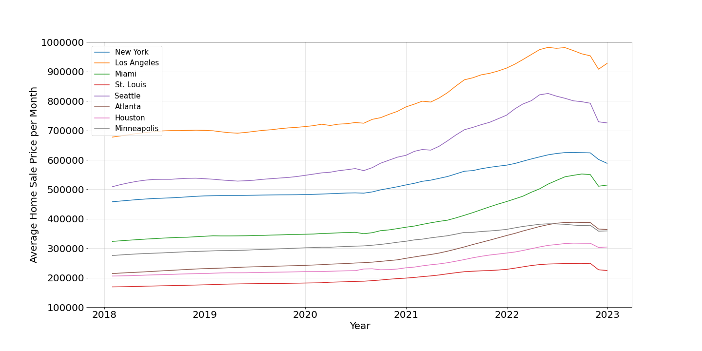
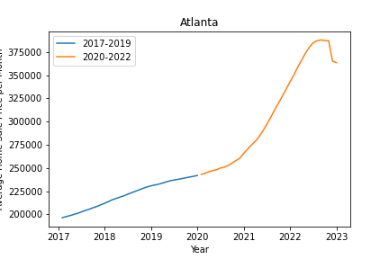
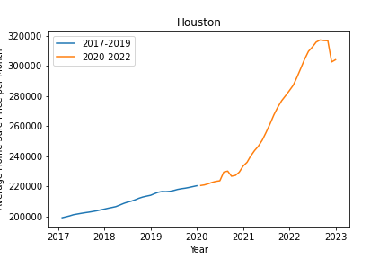
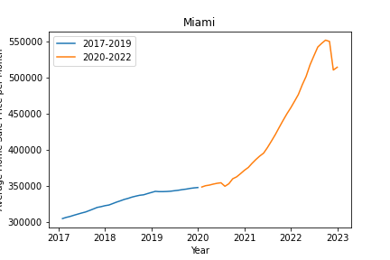
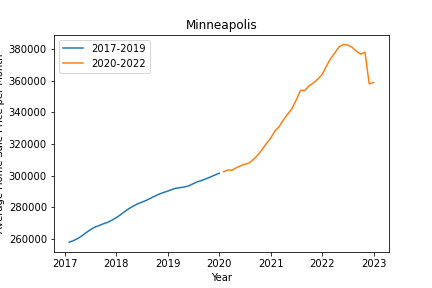
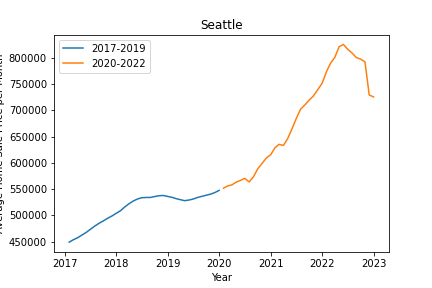
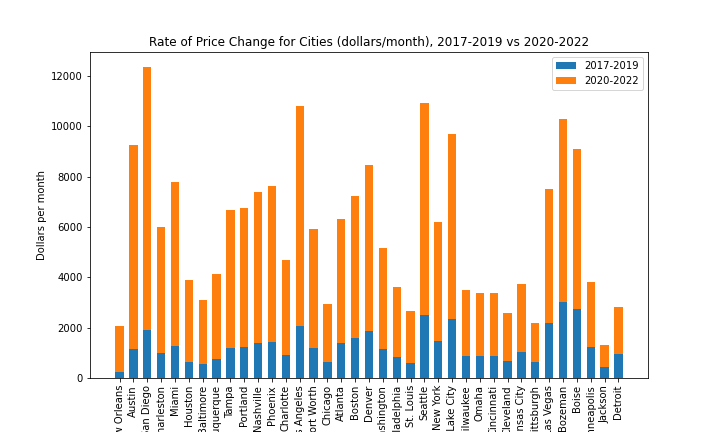

# Analyzing the Effects of COVID on the American Real Estate Market

Team members: Ali Bridgers, Harrison Riebow, Ed Shanks

In early 2020, the covid pandemic began, causing many macroeconomic changes around the world. One of the most notable effects was a sharp rise in housing prices in real estate markets across the United States. As a group, we wanted to investigate this particular phenomenon more closely. 

## Sources
We chose to use the Nasdaq Zillow API as our data source. The API offers a range of time series and metrics to track housing markets across the United States. We chose to focus on metro areas, as opposed to cities or zip codes. Metro areas encompass more residents, a wider range of socioeconomic groups, and a larger number of single-family homes. Our metric for tracking home prices is the Average Monthly Sales Price of Single-Family Homes in a Given Metro Area. For the sake of brevity, we will henceforth refer to this metric as Monthly Sales Price.

## Goals
In our study, we aim to answer three questions:
1.	How much did home prices increase after the beginning of the covid pandemic?
2.	Did any US real estate markets experience an abnormally sharp rise in home prices?
3.	Is there any correlation between the geographic location of a real estate market and the rate at which home prices accelerated in that market? 

### How much did home prices increase after the beginning of the covid pandemic?
We began by pulling sales price data for eight metro areas in the United States (New York, Los Angeles, Miami, St. Louis, Seattle, Atlanta, Houston, and Minneapolis) for the period from 2017 through 2022. We then plotted the monthly sales price for each city onto one chart. 

 

The monthly sales prices are in a constant uptrend for every city within this timeframe. Upon closer inspection, there is a small dip in some markets in mid-2020, followed by steeper increase in the monthly sales price in all markets shown on the plot. In 2020, the same year that the covid pandemic began, the monthly sales price increased sharply in all of the metropolitan areas in the sample. 

We chose to plot each of the eight markets individually and separate the plot into two distinct timeframes, namely 2017 – 2019 (i.e. pre-covid) and 2020 – 2022 (i.e. during covid). 

 

 

 

 

Based on the charts, it is clear from these graphs that the home prices increased more quickly between 2020 and 2022 than they did between 2017 and 2019 for each housing market that we included in the sample. 

### Did any US real estate markets experience an abnormally sharp rise in home prices?
To answer this question, we chose to build on the analysis from the first question. First, we expanded our data sample to include 37 metro areas from around the country. We then plotted the price from 2017 to 2022 using sublots for 2017-2019 and 2020-2022 for each city in the expanded sample. We then used a linear regression to calculate the slopes of each subplot for each metro area. These slopes represent the price velocity, or the rate of price change with respect to time, for a given time period. Here are the price velocities for each city plotted as a stacked bar chart:

 

Although this chart lends more evidence to the hypothesis that home prices increased more quickly after the onset of covid, it does not provide the information needed to accurately compare real estate markets with one another. In order to quantitatively compare the price evolution in these markets, we had to first create a ratio between the price velocity for 2017-2019 and the price velocity for 2020-2022. We chose to use percent change as our ratio. Percent change was calculated using the formula: 

% change = ( 〖price velocity〗_(2020-2022)- 〖price velocity〗_(2017-2019))/〖price velocity〗_(2017-2019) ×100
