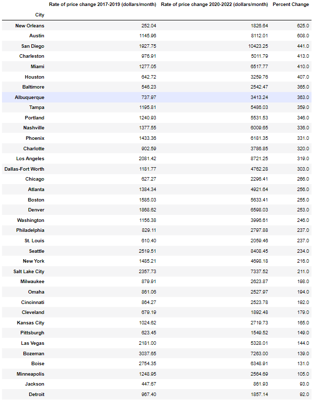
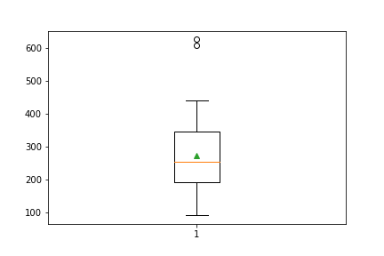

# Analyzing the Effects of COVID on the American Real Estate Market

Team members: Ali Bridgers, Harrison Riebow, Ed Shanks

In early 2020, the covid pandemic began, causing many macroeconomic changes around the world. One of the most notable effects was a sharp rise in housing prices in real estate markets across the United States. As a group, we wanted to investigate this particular phenomenon more closely. 

## Sources
We chose to use the Nasdaq Zillow API as our data source. The API offers a range of time series and metrics to track housing markets across the United States. We chose to focus on metro areas, as opposed to cities or zip codes. Metro areas encompass more residents, a wider range of socioeconomic groups, and a larger number of single-family homes. Our metric for tracking home prices is the Average Monthly Sales Price of Single-Family Homes in a Given Metro Area. For the sake of brevity, we will henceforth refer to this metric as Monthly Sales Price.

## Goals
In our study, we aim to answer three questions:
1.	How much did home prices increase after the beginning of the covid pandemic?
2.	Did any US real estate markets experience an abnormally sharp rise in home prices?
3.	Is there any correlation between the geographic location of a real estate market and the rate at which home prices accelerated in that market? 

### How much did home prices increase after the beginning of the covid pandemic?
We began by pulling sales price data for eight metro areas in the United States (New York, Los Angeles, Miami, St. Louis, Seattle, Atlanta, Houston, and Minneapolis) for the period from 2017 through 2022. We then plotted the monthly sales price for each city onto one chart. 

 

The monthly sales prices are in a constant uptrend for every city within this timeframe. Upon closer inspection, there is a small dip in some markets in mid-2020, followed by steeper increase in the monthly sales price in all markets shown on the plot. In 2020, the same year that the covid pandemic began, the monthly sales price increased sharply in all of the metropolitan areas in the sample. 

We chose to plot each of the eight markets individually and separate the plot into two distinct timeframes, namely 2017 – 2019 (i.e. pre-covid) and 2020 – 2022 (i.e. during covid). 

 

 

 

 

Based on the charts, it is clear from these graphs that the home prices increased more quickly between 2020 and 2022 than they did between 2017 and 2019 for each housing market that we included in the sample. 

### Did any US real estate markets experience an abnormally sharp rise in home prices?
To answer this question, we chose to build on the analysis from the first question. First, we expanded our data sample to include 37 metro areas from around the country. We then plotted the price from 2017 to 2022 using sublots for 2017-2019 and 2020-2022 for each city in the expanded sample. We then used a linear regression to calculate the slopes of each subplot for each metro area. These slopes represent the price velocity, or the rate of price change with respect to time, for a given time period. Here are the price velocities for each city plotted as a stacked bar chart:

 

Although this chart lends more evidence to the hypothesis that home prices increased more quickly after the onset of covid, it does not provide the information needed to accurately compare real estate markets with one another. In order to quantitatively compare the price evolution in these markets, we had to first create a ratio between the price velocity for 2017-2019 and the price velocity for 2020-2022. We chose to use percent change as our ratio. Percent change was calculated using the formula: 

% change = [((price velocity 2020-2022)- (price velocity 2017-2019))/(price velocity 2017-2019)] ×100 

Percent change can also be referred to as price acceleration, seeing as it the rate of change of the rate of change of housing prices with respect to time. These two terms will be used interchangeably from this point on. Below is a data frame containing the price velocity for each time period for each city and the resulting percent change, or price acceleration. The data is arranged by percent change in descending order. 

 

We then used a horizontal bar plot to plot the percent change of each metro area. 

 

Our second hypothesis is that there are some metro areas whose real estate markets grew at abnormally fast rates. For the sake of this study, we use price acceleration as the metric for the growth of a market and we designate an abnormally fast rate as a price acceleration which is a statistical outlier in the data set. To determine if there were any statistical outliers in the data set, we created a box plot using the price accelerations of each metro area in the expanded data set and got the following: 

 

Based on the box plot, this data is normally distributed. The mean and median are very close to one another and each of the legs has a very similar length. There are, however, two outliers on the right end of the distribution. These two outliers are New Orleans, Louisiana and Austin, Texas. This confirms that the New Orleans and Austin metro area real estate markets grew at abnormally fast rates well beyond those of any other cities in the data sample. 

### Is there any correlation between the geographic location of a real estate market and the rate at which home prices accelerated in that market?
To answer this question, we used the Geoviews module in Python to create an interactive map of the United States. We included each city from the expanded data sample and set the size parameter for each city to the corresponding price acceleration. The link to the interactive plot can be found here [https://sites.google.com/view/mapplot/home] 

The Geoviews module also allowed us to determine the latitude and longitude of each metro area. We then performed correlation tests using these geographical coordinates to determine if there is any correlation between a metro area’s price acceleration and geographic location. First, we plotted each market’s longitude versus its price acceleration on a scatter plot and ran a linear regression of the scatter plot. We also calculated the r and p-values for each correlation test. We did the same for latitude and got the following plots and values: 

#### Longitude vs Percent Change
 
With an r-value of only -0.024, there is almost no correlation between longitude and percent change. The p-value of 0.89 indicates that the null hypothesis (i.e. longitude has no correlation with the price acceleration) is true, further supporting the hypothesis that there is no discernable correlation between price acceleration and longitude. 

#### Latitude vs Percent Change
 
With an r-value of -0.65, there is a moderate negative correlation between latitude and percent change, meaning that the further south a city is located, the greater the price acceleration. The p-value of 〖1.50 ×10〗^(-5) indicates that the null hypothesis (i.e. latitude has no correlation with the price acceleration) is false, further supporting the hypothesis that there is in fact a correlation between a metro area’s latitude and its price acceleration. 

### Conclusions
*	Based on our analysis, home prices increased sharply across the country during the COVID-19 pandemic. 
*	Some metropolitan areas experienced an abnormally sharp rise in home prices, in particular New Orleans and Austin, both of which were statistical outliers in the expanded data set.
*	There is a moderate negative correlation between the price acceleration of a metropolitan area and its latitude. The significance of this correlation is validated by an extremely low p-value.

